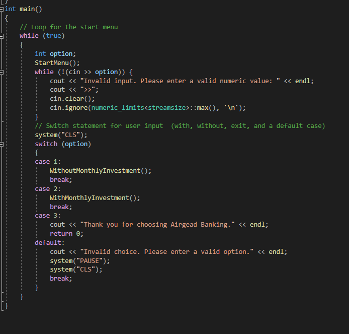

# Enhancement-One

The artifact I chose to enhance for Software Development and Engineering category is a banking application. The application is a calculator that generates an investment report based on user input. The artifact was developed in the C++ programming language. Visual Studio Integrated Development Environment (IDE) was the tool used to develop the application. The application, called Airgead Banking App, was the final project of CS-210 (Programming Languages), which was completed in Winter 2022. 
This artifact was developed at the beginning of my computer science program. I selected this artifact for enhancement to demonstrate my greater understanding of software development and engineering. Specifically, the improved structure, programming logic, and design will demonstrate my understanding of the C++ programming language. Adherence to engineering and programming practices by adding input validation and default deny clauses will help to ensure that the application operates properly and is more secure. 
The include libraries were adjusted from <stdio.h> to <iostream> ensuring access to the appropriate C++ libraries. In banking.hpp both functions do not change any of the member variables, so they were made const. The logic in this main application was previously all part one function. Refactoring this project to include separate functions for the start menu, and deposit menus, allowed me to create a structure for the program to perform its intended tasks. With these functions the program is more readable, and the functions could potentially be reused.
Figure #1- Start menu and without Monthly Investment functions.

 

 
The program has been refactored to include error checking of user input. Ensuring that only valid data is entered into the application allows the user to operate the program properly. By implementing input validation this enhances the software design of the application and mitigates design flaws by increasing security. Incorrect input prompts the user to re-enter the appropriate data and allows the application to continue with its process. The previous iteration of this application crashed or miscalculated incorrectly entered data due to the lack of input validation. 
Figure #2- Input validation

 

The initial main loop contained a while (1) clause which implicitly converts to true. To avoid any type conversions, I changed it to true. Refactoring the application to use a switch statement instead of a continuous loop, ensures the project can compile efficiently and improves the code clarity. 
Figure #3- Switch statement w/ default

 

The enhancements made to this application made it fully functional. The structure and design of the application was improved by implementing additional functions and by implementing standard coding principles. The engineering of the application was improved by adding validation, which makes the application work properly, and increases security. This aligns with course outcomes which demonstrate an ability to use well-founded and innovative techniques skills, and tools in computing practices for the purposes of implementing computer solutions that deliver value and accomplish industry specific goals. It also aligns with developing a security mindset that anticipates adversarial exploits in software architecture and designs to expose potential vulnerabilities, mitigate design flaws, and ensure privacy and enhanced security of data and resources.
I chose a project from the beginning of my program to measure my progress. It had been some time since I had used the C++ programming language, so I needed to reacquaint myself with its structure and syntax. I knew some of the strategies I wanted to implement in this program, such as input validation, but I needed to review some of these processes to properly refactor the code. Prior to this course, I was provided with programming tasks and parameters on how to meet these requirements. Refactoring code from previously submitted coursework presented me with some unfamiliarity. Through this enhancement, I increased my comfort level with the C++ programming language and increased my ability to properly refactor an application. 
