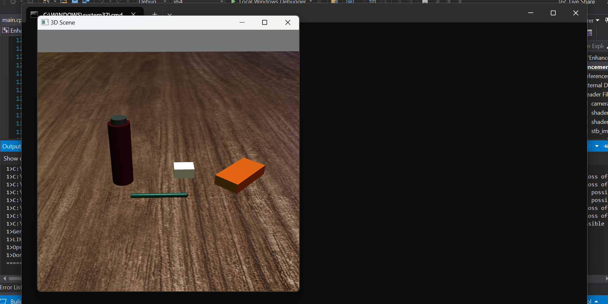

## **Code Review**

Code review is an examination of the project’s source code, also known as a peer review. My review contains includes my analysis of all three artifacts, where I examine the existing application functionality, target areas for improvement, and provide a plan to enhance each artifact. A code review is a necessary part of the software best practices because finding errors early in the software development lifecycle process saves time, reduces project costs, and promotes team interaction in a collaborative environment. Reviewing the three selected artifacts helped me apply strategies for building collaborative environments that enable diverse audiences to support organizational decision making in the field of computer science. 

View the code review: [Code Review](https://youtu.be/6cdXHpRNkXQ)

    <a href="#">
        <button style="font-size: 10px; font-weight: 500; background: #909090; color: #ffffff; border-radius: 50px; border-style: solid; border-color: #909090; padding: 5px 8px;">Back to Top &#8593;</button>
    </a>

## **Enhancement One: Software Engineering and Development**

The artifact I chose to enhance for Software Development and Engineering category is a banking application. The application is a calculator that generates an investment report based on user input. The artifact was developed in the C++ programming language. Visual Studio Integrated Development Environment (IDE) was the tool used to develop the application. The application, called Airgead Banking App, was the final project of CS-210 (Programming Languages), which was completed in Winter 2022. I selected this artifact for enhancement to demonstrate my greater understanding of software development and engineering. Specifically, the improved structure, programming logic, and design demonstrated my understanding of the C++ programming language. Adherence to engineering and programming practices by adding input validation and default deny clauses help to ensure that the application operates properly and is more secure.

The program has been refactored to include error checking of user input. Ensuring that only valid data is entered into the application allows the user to operate the program properly. By implementing input validation this enhances the software design of the application and mitigates design flaws by increasing security. Incorrect input prompts the user to re-enter the appropriate data and allows the application to continue with its process. The previous iteration of this application crashed or miscalculated incorrectly entered data due to the lack of input validation.

  

The enhancements made to this application made it fully functional. The structure and design of the application was improved by implementing additional functions and by implementing standard coding principles. The engineering of the application was improved by adding validation, which makes the application work properly, and increases security. This aligns with course outcomes which demonstrate an ability to use well-founded and innovative techniques skills, and tools in computing practices for the purposes of implementing computer solutions that deliver value and accomplish industry specific goals. It also aligns with developing a security mindset that anticipates adversarial exploits in software architecture and designs to expose potential vulnerabilities, mitigate design flaws, and ensure privacy and enhanced security of data and resources.

I chose a project from the beginning of my program to measure my progress. It had been some time since I had used the C++ programming language, so I needed to reacquaint myself with its structure and syntax. I knew some of the strategies I wanted to implement in this program, such as input validation, but I needed to review some of these processes to properly refactor the code. Prior to this course, I was provided with programming tasks and parameters on how to meet these requirements. Refactoring code from previously submitted coursework presented me with some unfamiliarity. Through this enhancement, I increased my comfort level with the C++ programming language and increased my ability to properly refactor an application.

View the artifact enhancement: [Software Design and Engineering Artifact](https://github.com/sdmnh1/sdmnh1.github.io/tree/main/CS%20499%20Software%20Design%20and%20Engineering)

View the artifact narrative: [Software Design and Engineering Narrative](https://view.officeapps.live.com/op/view.aspx?src=https%3A%2F%2Fraw.githubusercontent.com%2Fsdmnh1%2Fsdmnh1.github.io%2Fmain%2FNarratives%2FCS%2520499%25203-2%2520Milestone%2520Two.docx&wdOrigin=BROWSELINK)

    <a href="#">
        <button style="font-size: 10px; font-weight: 500; background: #909090; color: #ffffff; border-radius: 50px; border-style: solid; border-color: #909090; padding: 5px 8px;">Back to Top &#8593;</button>
    </a>

## **Enhancement Two: Algorithms and Data Structure**

The artifact I chose to enhance in the Algorithms and Data Structures category is an OpenGL 3D project. OpenGL is an application programming interface (API) that provides a large set of functions for rendering graphics. The artifact was developed in the C++ programming language. Visual Studio Integrated Development Environment (IDE) was the tool used to develop the application. The scene was originally developed as a final project in CS-330 (Computer Graphics and Visualization), which was completed in Winter 2023.

The artifact I chose to enhance in the Algorithms and Data Structures category is an OpenGL 3D project. OpenGL is an application programming interface (API) that provides a large set of functions for rendering graphics. The artifact was developed in the C++ programming language. Visual Studio Integrated Development Environment (IDE) was the tool used to develop the application. The scene was originally developed as a final project in CS-330 (Computer Graphics and Visualization), which was completed in Winter 2023.

Initially, the development of this artifact presented many challenges. As I completed the project and rendered objects, I knew that I needed to expand my knowledge of OpenGL. I chose to enhance this artifact to demonstrate my greater understanding of how to implement algorithms and data structures in conjunction with OpenGL functions. Specifically, I presented skills that implement code to improve the structure and design of the project. I demonstrated skills that implement the use of algorithmic functions to compute a surface normal. I demonstrated my understanding of the OpenGL API and my understanding of the C++ programming language.

  

Previously, all the programming logic for the program was contained in main.cpp. The shader functions were refactored, and a separate shader class was created, and header files were created for the project to provide more segmentation and readability. The objects scale, rotation, and translation were corrected to reflect the appropriate values. I removed the use of the standard namespace from the application, opting to place std:: in front of functions from the standard library. While this may not be critical in this project, I used best practices to make it clear which namespace a function belongs to, to avoid collisions in projects that use multiple namespaces. An interleaved structure format was used to process the vertex data. The vertices, normals, and texture coordinate attributes were processed in a single buffer object instead of using multiple buffers. In this format, the graphics processing unit (GPU) processes this data from one location, improving performance, but also potentially using more memory.

The enhancements made to this application allowed the objects to render correctly in configuration and scale. The structure and design of the application was improved by implementing additional classes and header files and by implementing standard coding principles. The algorithmic logic of the application was improved by applying functions to compute data, allowing the application to render properly. This aligns with course outcomes that demonstrate the ability to use well-founded and innovative techniques skills, and tools in computing practices for the purposes of implementing computer solutions that deliver value and accomplish industry specific goals. It also aligns with outcomes which design and evaluate computing solutions that solve a given problem using algorithmic principles and computer science practices and standards appropriate to its solution, while managing the trade-offs involved in design choices.

View the artifact enhancement: [Algorithms and Data Structure Artifact](https://github.com/sdmnh1/sdmnh1.github.io/tree/main/CS%20499%20Algorithms%20and%20Data%20Structure)

View the artifact narrative: [Algorithms and Data Structure Narrative](https://view.officeapps.live.com/op/view.aspx?src=https%3A%2F%2Fraw.githubusercontent.com%2Fsdmnh1%2Fsdmnh1.github.io%2Fmain%2FNarratives%2FCS%2520499%25204-2%2520Milestone%2520Three%2520.docx&wdOrigin=BROWSELINK)

    <a href="#">
        <button style="font-size: 10px; font-weight: 500; background: #909090; color: #ffffff; border-radius: 50px; border-style: solid; border-color: #909090; padding: 5px 8px;">Back to Top &#8593;</button>
    </a>

## **Enhancement Three: Databases**

The artifact I chose to enhance in the Databases category is a from DAD-220 (Introduction into Structure Databases), which was completed in the fall of 2022. The artifact was originally used in a virtual lab, using a Linux platform. The artifact is a CSV data file used in the course to write queries. The file contains vehicle, damage, and repair statistics for a fleet of vehicles. I selected this artifact so that I could use the information contained in the file to develop an application with create, read, update, and delete functionality to manage the data.

Developing a user interface that allows a user to manipulate the data imported into MySQL demonstrates my understanding of databases. The project was developed in the Python programming language, and MySQL was used to store and manage the database. The MySQL Workbench tool was used to create the database and table. Visual Studio Code was used as the code editor for this project. The use and integration of these tools demonstrated my ability to develop a secure, fully functional database application.

The program was developed using error checking engineering practices that allow the application to fail gracefully, exit without crashing, and help to make the program more secure. To help prevent SQL injection, the application was developed using practices such as input filtering and query parameterization. Adherence to secure coding best practices was used to develop the project, which will help ensure that the application functions properly, is secure, and maintainable. These skills demonstrate and align with course outcomes that develop a security mindset that anticipates adversarial exploits in software architecture and designs to expose potential vulnerabilities, mitigate design flaws, and ensure privacy and enhanced security of data and resources.

  

While enhancing this artifact, I re-familiarized myself with the syntax of the SQL programming language. I learned how to use the MySQL Workbench development tool while creating this artifact as. Previously, I used the command line for database projects. I had previously used the Tkinter graphical user interface (GUI) toolkit to build smaller projects, but I expanded my knowledge during the development of this artifact. Implementing the widget features of Tkinter, such as the tree view, allowed the data to be displayed in a table, which is a visually appealing way to interact with the data.

This artifact was developed using a file from my previous course, so it was a fun challenge to create the layout to incorporate all the aspects of the program needed to make it function. Installing the import Python package (pymysql) was surprisingly tricky, but once I used the proper connection method, it functioned properly. Through this enhancement, I increased my comfort level with the Python programming language, with MySQL, and I increased my ability to properly develop a database application.

View the artifact enhancement: [Databases Artifact](https://github.com/sdmnh1/sdmnh1.github.io/tree/main/CS%20499%20Databases)

View the artifact narrative: [Databases Narrative](https://view.officeapps.live.com/op/view.aspx?src=https%3A%2F%2Fraw.githubusercontent.com%2Fsdmnh1%2Fsdmnh1.github.io%2Fmain%2FNarratives%2FCS%2520499%25205-2%2520Milestone%2520Four.docx&wdOrigin=BROWSELINK)

    <a href="#">
        <button style="font-size: 10px; font-weight: 500; background: #909090; color: #ffffff; border-radius: 50px; border-style: solid; border-color: #909090; padding: 5px 8px;">Back to Top &#8593;</button>
    </a>

